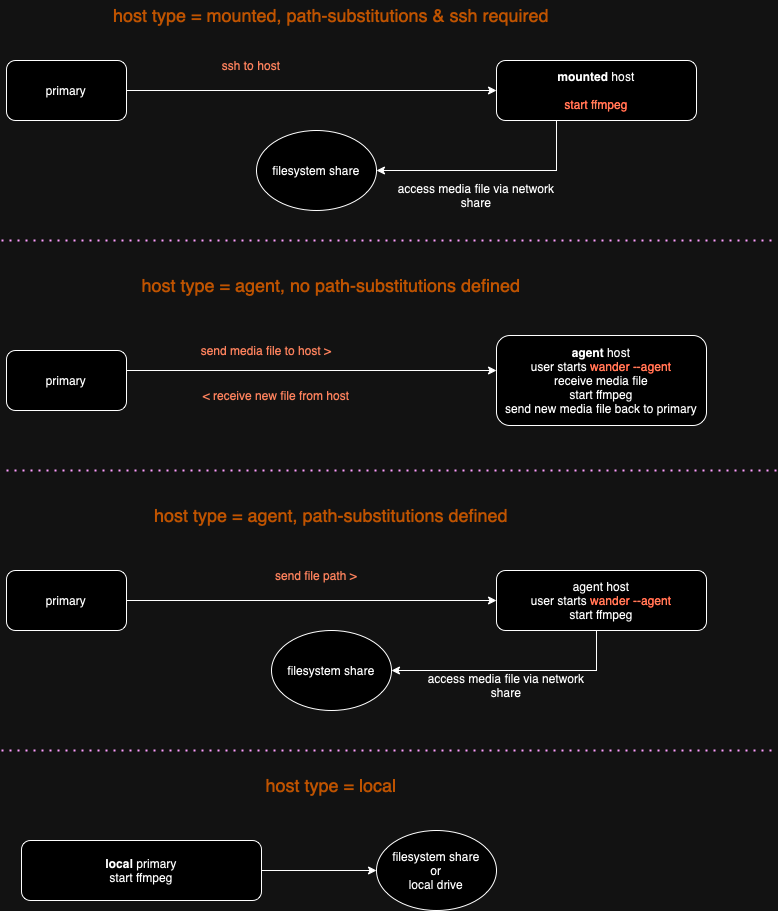

# wandarr 1.x Host Types 

---
When configuring a cluster of multiple machines you need to designate how each machine is communicated with. 
Wandarr supports several modes, all of which operate either using **ssh** or the custom agent protocol.

## ssh
A _mounted_ host type is one where wandarr open an **ssh** session to that host and runs **ffmpeg** on your behalf.
It maps file paths to ones accessible by that host using the path-substitutions section of the host config file (see path-substitutions below)

Requirements
1. You must be able to ssh to each host without a password prompt (using ssh keys).
2. The user account on the host has necessary access to network share where media resides.
3. ffmpeg installed on each host.

PROS
* No need to install wandarr on each host

CONS
* You may not want to use ssh keys for authentication to your hosts.
* Setting up password-less ssh to Windows is tricky, and accessing shares is almost impossible from an ssh shell. This was the primary justification for creating the custom agent in the first place.

---
## agent
Wandarr has a built-in custom agent that negates the need for ssh.  When a host is defined as type = agent, wandarr will
communicate directly to the other wandarr on the host (started with ```wandarr --agent```).  In this setup, media files can
either be copied to and from the host or access via a windows share (SMB).

Requirements
1. Wandarr installed on host.
2. ffmpeg installed on each host and started before transcoding is kicked off.
3. Access to local or network share as needed.

PROS
* Less setup (no ssh configuration)
* Can be used in _copy_ or _share_ mode.

CONS
* As of version 1.0.7 there is no security on the endpoint so it is expected the user have a secure networking environment. A more secure design is on the road map.
* Multiple copies of wandarr to upgrade as they happen.
* You must log into the host and manually start wandarr in agent mode.
---

## path-substitutions

For any host that needs to access media via a network share you must set up path-substitutions in the host definition.
This is required for the _mounted_ type and optional for _agent_.

For example, you are running your transcode jobs from MacOS and you access your media on a network share called "media"
that resides on a NAS as "/volume1/media"

You might start transcodes like:
```bash
wandarr -t normal /Volumes/media/inbox/test_video.mkv
```
You also have other hosts in your cluster and they need to know how to access the same files.  They won't be the same path
because that is a MacOS-specific path.  So you need to tell wandarr how to map path access on your working machine to
paths on the host.

So, for a Windows host you may have mapped "m:" to /volume1/media on the NAS. In this case the path-substitution would
read: ```/Volumes/media m:```  When wandarr hands the transcode task to the Windows host it will use m:inbox/test_video.mkv 
at the access path.

Another linux host may mount the media share as /mnt/nas-media. In this case the path-substitution will read: ```/Volumes/media /mnt/nas-media```

You can have as many path-substitution lines as you like, representing any root folders to media you need to access.

---


